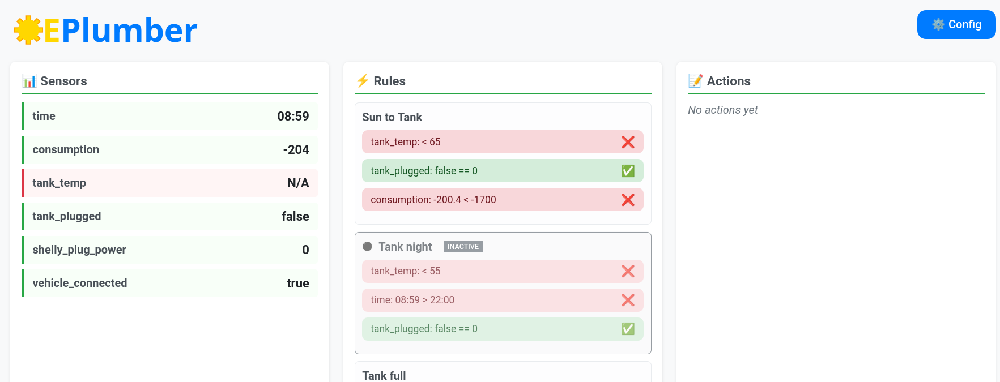

# EPlumber

A Python-based IoT automation system that monitors sensors via MQTT and HTTP, evaluates rules, and triggers actions. Designed for home automation scenarios like managing water heating based on solar power production, temperature, and time conditions.



## Architecture

- **Sensors**: Collect data from various sources (MQTT topics, HTTP endpoints, system time)
- **Rules**: Define automation logic with multiple test conditions  
- **Actions**: HTTP-based commands to control devices
- **Main loop**: Continuously evaluates rules and triggers actions when conditions are met

## Hardware Compatibility

This project is used with:
- **[EmonPi](https://openenergymonitor.org/)** energy monitoring system with MQTT broker for solar monitoring running on Raspberry Pi
- **[OpenEVSE](https://www.openevse.com/)** charging station for electric vehicle monitoring
- **[Shelly](https://www.shelly.com/) switches** and temperature sensors for water heater control 
- **Shelly plugs** for battery charger management

These hardware solutions could be run on local network, with http and/or mqtt support.


## Installation

1. Clone the repository:
```bash
git clone https://github.com/freddez/eplumber
cd eplumber
```

2. Install dependencies using [uv](https://docs.astral.sh/uv/):
```bash
uv sync
```

## Configuration

Create an `eplumber.json` configuration file in the project directory or user config directory:

```json
{
  "global": {
    "recipients": ["your-email@example.com"]
  },
  "mqtt": {
    "host": "your-mqtt-broker",
    "port": 1883,
    "username": "mqtt-user",
    "password": "your-password"
  },
  "sensors": [
    {
      "name": "consumption",
      "route": "emon/emonpi/power1"
    },
    {
      "name": "tank_temp",
      "json_path": "'tC'",
      "route": "shelly/status/temperature:100"
    },
    {
      "name": "tank_switch_status",
      "type": "http",
      "route": "http://192.168.0.15/rpc/Shelly.GetStatus",
      "json_path": "'switch:0'.output",
      "return_type": "bool"
    },
    {
      "name": "vehicle_connected",
      "route": "emon/openevse/vehicle",
      "return_type": "bool"
    }
  ],
  "actions": [
    {
      "name": "switch_on_tank",
      "route": "http://192.168.0.15/relay/0?turn=on"
    },
    {
      "name": "switch_off_tank",
      "route": "http://192.168.0.15/relay/0?turn=off"
    }
  ],
  "rules": [
    {
      "name": "Solar to Water Heater",
      "tests": [
        ["tank_temp", "<", 65],
        ["tank_switch_status", "==", false],
        ["consumption", "<", -1700]
      ],
      "action": "switch_on_tank"
    },
    {
      "name": "Night Heating",
      "tests": [
        ["tank_temp", "<", 55],
        ["time", ">", "22:00"],
        ["tank_switch_status", "==", false]
      ],
      "action": "switch_on_tank"
    },
    {
      "name": "Tank Full - Turn Off",
      "tests": [
        ["tank_switch_status", "==", true],
        ["time", ">", "08:00"],
        ["time", "<", "21:00"],
        ["tank_temp", ">", 68]
      ],
      "action": "switch_off_tank"
    }
  ]
}
```

### Configuration Sections

- **global**: Email recipients for notifications
- **mqtt**: MQTT broker connection settings
- **sensors**: Define data sources (MQTT topics, HTTP endpoints). 
  - With json payload, single value are extracted with **json_path** parameter, expressed in [jq](https://jqlang.org/) syntax.
  - Current sensor value is computed with mean of the last **value_list_length** values (default to 5). Changing this value will affect the reactivity of actions related to that sensor.
- **actions**: HTTP commands to control devices
- **rules**: Automation logic with test conditions and actions
  - Each rule could be desactivated with the **active** flag

### Sensor Types

- **MQTT sensors**: Subscribe to MQTT topics for real-time data
- **HTTP sensors**: Poll HTTP endpoints for device status
- **Time sensors**: Built-in time source for schedule-based rules

## Usage

Run the application:

```bash
make run
# or
uv run main.py
```

For debugging:
```bash
make rundbg
```

## Systemd Service Setup

To run eplumber as a system service that automatically restarts on configuration changes:

**1. Create the main service file `/etc/systemd/system/eplumber.service`:**
```ini
[Unit]
Description=Eplumber IoT Automation System

[Service]
User=fredz
ExecStart=/home/fredz/bin/uv --directory /home/fredz/src/eplumber run main.py --loglevel warning
Restart=on-failure

[Install]
WantedBy=multi-user.target
```

**2. Create the configuration watcher `/etc/systemd/system/eplumber-config.path`:**
```ini
[Unit]
Description=Watch eplumber configuration file
PathExists=/home/fredz/src/eplumber/eplumber.json

[Path]
PathChanged=/home/fredz/src/eplumber/eplumber.json

[Install]
WantedBy=multi-user.target
```

**3. Create the restart service `/etc/systemd/system/eplumber-config.service`:**
```ini
[Unit]
Description=Restart eplumber when config changes

[Service]
Type=oneshot
ExecStart=/bin/systemctl restart eplumber.service
```

**4. Enable and start the services:**
```bash
sudo systemctl daemon-reload
sudo systemctl enable eplumber.service
sudo systemctl enable eplumber-config.path
sudo systemctl start eplumber.service
sudo systemctl start eplumber-config.path
```

**5. Check service status:**
```bash
sudo systemctl status eplumber.service
sudo systemctl status eplumber-config.path
```


## Example Use Cases

### Solar Water Heating
Automatically turn on water heater when:
- Tank temperature is below threshold
- Solar panels are producing excess power (negative consumption)
- Tank is currently off

### Smart Charging
Control battery chargers based on:
- Power consumption levels
- Time of day restrictions
- Device connection status

### Temperature Management
Monitor and control heating based on:
- Current temperature readings
- Time-based schedules
- System status checks


## License

This project is licensed under the GNU General Public License v3.0 - see the [LICENSE](LICENSE) file for details.
